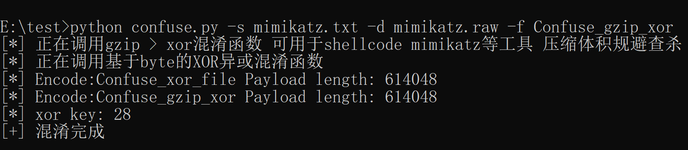

# Simple-Confusion
## 简介

> 混淆加密文件以到达免杀效果，基于Python3开发，无需依赖。

## 混淆函数
可用混淆函数列表：

- Confuse_uuid 使用uuid加密
- Confuse_xor_str 对str进行xor混淆
- Confuse_xor_file 对byte进行xor混淆
- Confuse_gzip_xor 使用gzip压缩数据 > Xor异或混淆 适用于体积较大的工具，可用于shellcode、mimikatz等工具，压缩体积规避查杀
- Confuse_uuid_xor_gzip_hex 使用uuid加密 > xor异或 > gzip压缩 > hex 进行混淆，效果很好，适用于CS与MSF生成的shellcode，规避查杀

## 使用指北
查看帮助：

```
python confuse_tools.py --help
```


调用Confuse_gzip_xor对mimikatz进行混淆

```
python confuse_tools.py -s test.txt -d test.raw -f Confuse_gzip_xor
```



可以获取到随机生成的xor_key。(注意：这个key，请自行解密。)

### 支持自定义密钥，默认随机生成。

```
python confuse_tools.py -s mimi.txt -d mimi.raw -f Confuse_gzip_xor -k 70
```

## virustotal查杀

混淆前


混淆后


